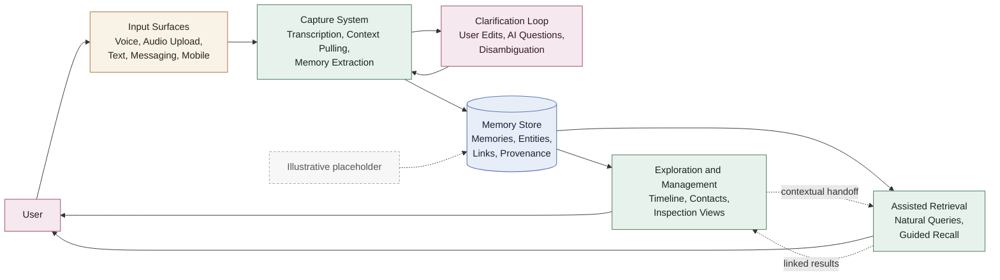

# Never Forget — Product Summary

## Overview

Never Forget is a voice-first personal memory system designed to capture information with minimal friction. Instead of requiring structured input or manual categorization, the system relies on speech transcription and an LLM extraction step to transform spoken input into persistent memories.

The core design goal is **low input barrier**: users should be able to record thoughts, events, facts, and reminders naturally using voice. The system then processes the transcription and extracts structured or semi-structured memories representing the captured information.

The product emphasizes:

* minimal cognitive overhead during capture
* durable storage of meaningful information
* simple extensible data modeling
* offline-first architecture

The system is initially implemented as a prototype using Python and SQLite and may later evolve into a standalone offline-first application.

---

## Desired User Experience

Using the system should feel lightweight, supportive, and trustworthy. Capturing information should require little effort, and retrieving it later should feel easier than manually searching through notes.

The product should help the user externalize everyday information without forcing heavy organization work up front, while still making stored information reliable enough to be useful later.

Examples:

* A user records a quick voice note about meeting Anna's brother at dinner, and the system turns it into useful memories with only a small clarification if needed.
* A user later asks what they last discussed with Anna, and the system surfaces the relevant memories without requiring them to browse through a timeline manually.

---

## Product Philosophy

### Capture First, Structure Later

The system prioritizes capturing information reliably over immediately enforcing strict structure.

Most captured information is fundamentally textual and unstructured (in rare cases semi-structured but still textual). Structured information is therefore treated as optional enrichment rather than a strict requirement.

This allows the system to:

* remain resilient to imperfect extraction
* always be LLM-ready
* support iterative enrichment over time

### Voice-First Interaction

Traditional note systems require typing and manual categorization. This creates friction and discourages consistent use.

Never Forget instead prioritizes:

1. voice capture
2. transcription
3. LLM-based extraction

The LLM converts the transcription into one or more **memories**, which represent the persisted units of information.

### Maximize Captured Signal

The usefulness of the system depends heavily on how much relevant information a user can realistically and consistently provide over time.

Lowering input friction therefore increases product value: the easier it is to capture information, the more context the system has available for future retrieval, linking, and assistance.

This only works if ease of input does not come at the cost of quality. The product should therefore minimize manual typing, list navigation, and reference selection while using UX guidance and AI support to help keep captured information accurate and useful.

## Core Components

The application can be understood as four core components that work together:

1. Capture System
2. Memory Store
3. Exploration and Management
4. Assisted Retrieval

The following flow is a provisional sketch of how information may move through these components:

### Capture System

The capture system is responsible for turning raw user input into persisted memories with as little friction as possible.

It begins at the capture interface. This may be voice recording, audio upload, or direct text input in a web app, but it may later also include messaging integrations or mobile-first capture interfaces designed for everyday use.

The capture system then transforms incoming input into processable content such as text and images. This material is passed to an LLM, which may pull in relevant context, resolve likely references, and generate one or more memories for persistence.

The capture system also includes correction and clarification loops. Users should be able to intervene when needed, for example by editing a raw transcription and resubmitting it, or by answering lightweight follow-up questions when the system needs help disambiguating people, entities, or intent.

### Memory Store

The memory store is the durable system of record for the application.

It persists the outputs of the capture system and provides the foundation used by both browsing interfaces and retrieval workflows. At a high level this includes captured memories, stable entities such as persons, and the links and provenance needed to understand where information came from.

At this stage the memory store is described conceptually rather than as a detailed schema. Its role is to provide reliable long-term storage for the user's information while keeping the model simple enough to evolve over time.

### Exploration and Management

Exploration and management covers the interfaces through which users manually inspect, navigate, and organize what has been captured.

This may include views such as a timeline of memories, person-centric views such as contacts, and other interfaces for browsing relationships or reviewing accumulated information. The purpose of this component is to make the stored memory base understandable and inspectable without requiring an LLM-mediated interaction for every task.

This area is still less defined than the capture system and will require further refinement as product usage patterns become clearer.

### Assisted Retrieval

Assisted retrieval is the low-friction mechanism for finding and surfacing relevant information without requiring the user to manually navigate the stored data.

Where exploration and management is based on deliberate browsing, assisted retrieval is intended to support natural queries, guided recall, and context-sensitive retrieval using LLMs or similar mechanisms. The goal is to make retrieving information feel as lightweight as capturing it.

This component is still at an early conceptual stage, but it is expected to become a major part of the product because manual browsing alone does not satisfy the overall low-friction design goal.

