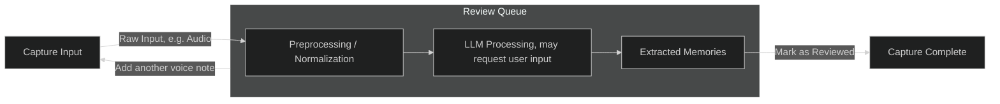
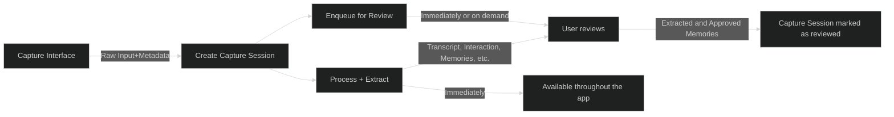

# Capture System

The capture system is at the heart of the application.

## Overview

The capture system turns human input into stored information while keeping capture lightweight. It is built around capture sessions. A capture session is created from user input, immediately registered in the review queue, and then progresses through preprocessing, LLM processing, persistence, and later review or continuation as needed.

The review queue is not the final stage of a linear pipeline. It is the user's way to inspect or resume a capture session at whatever state it is currently in. Review begins as soon as the capture session exists.

Generated artifacts should generally become immediately usable once they have been created and persisted. Review and correction should improve or update that information after the fact, rather than making captured information unusable until the user has reviewed it.

The capture flow should avoid getting stuck where possible. Some cases may still require user input when the system should not guess.

**Standard Flow**

**Standard Input Flow - Technical Perspective**

## Capture Interface

A **Capture Interface** is any user-facing interface through which information enters the Never Forget system. Its sole responsibility is to allow users to quickly submit thoughts, observations, or reminders into the capture system with minimal friction.

Capture Interfaces act as the **entry point of the capture system**, converting user interaction into a **Capture Session**. They do not perform semantic processing or categorization themselves; their role is limited to collecting the user's input and creating or forwarding it into the capture-session flow.

A Capture Interface typically performs the following responsibilities:

- collect user input (voice, text, or other content)
- initiate a **Capture Session**
- attach any relevant metadata (timestamp, device source, attachments)
- forward the captured input for preprocessing and LLM processing

Once input is submitted, the Capture Interface's role ends and the capture system takes over.

Examples of Capture Interfaces include:

- **Mobile App Voice Recorder** - the primary interface for capturing spoken thoughts.
- **Web Application Input UI** - allows direct text or audio capture from a browser.
- **Share / "Send to Never Forget" Extension** - captures text, URLs, or media from other applications.
- **WearOS Quick Capture** - enables fast voice notes from a wearable device.
- **Messaging Integration (e.g., Telegram Bot)** - allows users to send messages that are treated as capture input.

All Capture Interfaces ultimately produce the same output: a **Capture Session**.

The LLM does **not manage stored memories**, update records, or perform CRUD operations. It only emits extraction results.
