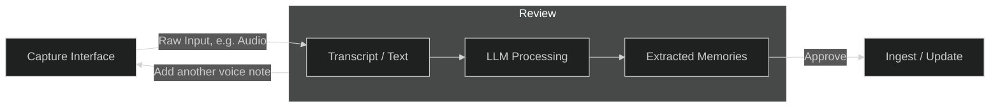
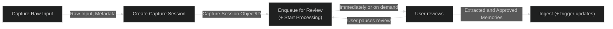

# Capture System

The capture system is at the heart of the application.

## Overview

The Capture System consist of the following components, which essentially form a pipeline from human input to information (like memories) being stored in the application.

**Standard Input Flow - User Perspective**

**Standard Input Flow - Technical Perspective**

## Capture Interface

A **Capture Interface** is any user-facing interface through which information enters the Never Forget system. Its sole responsibility is to allow users to quickly submit thoughts, observations, or reminders into the capture system with minimal friction.

Capture Interfaces act as the **entry point of the capture system**, converting user interaction into a **Capture Session**. They do not perform semantic processing or categorization themselves; their role is limited to collecting the user's input and forwarding it to the system for transcription and artifact extraction.

A Capture Interface typically performs the following responsibilities:

- Collect user input (voice, text, or other content)
- Initiate a **Capture Session**
- Attach any relevant metadata (timestamp, device source, attachments)
- Forward the captured input to the transcription and processing system

Once input is submitted, the Capture Interface's role ends and the processing system takes over (see overview above).

Examples of Capture Interfaces include:

- **Mobile App Voice Recorder** — the primary interface for capturing spoken thoughts.
- **Web Application Input UI** — allows direct text or audio capture from a browser.
- **Share / “Send to Never Forget” Extension** — captures text, URLs, or media from other applications.
- **WearOS Quick Capture** — enables fast voice notes from a wearable device.
- **Messaging Integration (e.g., Telegram Bot)** — allows users to send messages that are treated as capture input.

All Capture Interfaces ultimately produce the same output: a **Capture Session** that enters the processing system.

The LLM does **not manage stored memories**, update records, or perform CRUD operations. It only emits extraction results.

# Product Workflow

## Step 1 — Capture

User records audio.

System creates a CaptureSession.

## Step 2 — Transcription

Audio is transcribed using ASR.

Transcript is stored in the CaptureSession.

## Step 3 — Memory Extraction

The transcription is provided to an LLM.

The LLM extracts memories representing meaningful information.

## Step 4 — Persistence

Memories are persisted using a batch ingestion tool.

The process ends after ingestion.

## Capture Session

Represents a single voice capture event.

Fields:

* id
* audio_ref
* transcript
* transcript_segments (optional)
* created_at
* metadata

Notes:

CaptureSession management is handled by orchestration and not exposed to the LLM.
